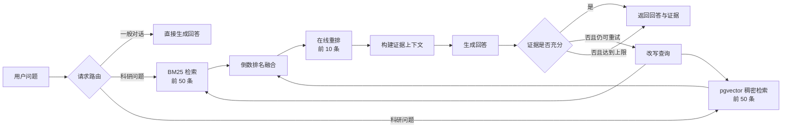

<div align="center">

# Adaptive Scientific RAG

**面向科研证据检索的自适应检索增强生成系统**

以 SciFact / BEIR 为评测基准，融合关键词检索、向量检索、在线重排与证据校验，
为科研问题提供可追溯、可评测的回答。


[功能亮点](#-功能亮点) · [系统架构](#-系统架构) · [快速开始](#-快速开始) · [接口说明](#-接口说明) · [评测体系](#-评测体系)

</div>

---

## 📖 项目简介

Adaptive Scientific RAG 是一个以评测为先的科研检索增强生成系统。它围绕
[SciFact](https://github.com/allenai/scifact) 数据集构建，通过混合检索、在线重排和有界自适应工作流，
在生成回答的同时返回证据片段、检索过程与校验结果。

系统会区分一般对话与科研问题：一般对话绕过检索直接生成；科研问题进入完整的检索、生成、证据校验和有限重试流程。

## ✨ 功能亮点

| 能力 | 说明 |
| --- | --- |
| 混合检索 | BM25 与 pgvector 稠密检索并行执行，通过倒数排名融合合并结果 |
| 在线重排 | 使用独立的重排模型对融合结果进行精排，默认保留前 10 条证据 |
| 自适应生成 | 证据不足时自动改写查询并重新检索，所有重试均有明确上限 |
| 证据可追溯 | 回答包含证据摘要、来源排名、校验状态、查询历史和终止原因 |
| 流式交互 | 后端通过 NDJSON 持续发送生成内容，前端实时呈现回答进度 |
| 评测优先 | 内置检索指标与 Ragas 生成评测入口，开发评测不会使用测试集标签 |
| 供应商解耦 | 向量化、重排和回答生成分别配置，可独立选择服务与凭据 |
| 离线可测试 | 核心接口支持依赖注入，单元测试使用确定性替身且不依赖外部服务 |

## 🏗️ 系统架构



BM25 与稠密检索并行执行。请求路由、一般对话、证据校验和查询改写会显式关闭供应商的思考模式；
回答生成保留所配置模型的默认行为，并将可见回答内容流式传输到浏览器。

### 技术栈

| 层级 | 技术 |
| --- | --- |
| 前端 | React 19、TypeScript、Vite、Tailwind CSS、shadcn/ui |
| 后端 | Python 3.12、FastAPI、Pydantic、SQLAlchemy |
| 数据库 | PostgreSQL 16、pgvector 0.8.6 |
| 检索 | BM25、稠密向量检索、倒数排名融合、在线重排 |
| 数据迁移 | Alembic |
| 部署 | Docker Compose、Nginx |
| 测试 | Pytest、Vitest、Testing Library |

## 🚀 快速开始

### 环境要求

- Docker 与 Docker Compose
- 可用的向量化、重排和对话生成服务凭据
- 无需显卡，也无需在本地下载模型

### 使用 Docker Compose 启动

1. 创建本地环境变量文件：

   ```bash
   cp .env.example .env
   ```

2. 编辑 `.env`，至少填写以下配置：

   ```dotenv
   ASR_EMBEDDING_API_KEY=
   ASR_RERANKER_API_KEY=
   ASR_LLM_API_KEY=
   ASR_LLM_MODEL=
   ```

3. 构建并启动全部服务：

   ```bash
   docker compose up --build
   ```

4. 打开服务：

   - 前端界面：<http://127.0.0.1:3000>
   - 后端接口：<http://127.0.0.1:8000>
   - 接口文档：<http://127.0.0.1:8000/docs>

首次启动时，一次性 `bootstrap` 服务会自动执行数据库迁移、构建 BM25 索引，并分批构建 pgvector 向量索引。
后续启动会复用兼容索引，只重新处理发生变化的文档。若供应商、模型、向量维度、距离度量或索引版本不一致，
系统会拒绝混用已有向量。

### 检查服务状态

```bash
docker compose ps
curl http://127.0.0.1:8000/health
curl http://127.0.0.1:8000/ready
```

- `/health` 只检查进程是否存活，不访问数据库或外部模型服务。
- `/ready` 检查 PostgreSQL、pgvector 扩展、数据库迁移、必需表和向量索引元数据，不调用外部模型服务。

### 停止服务

```bash
docker compose down
```

该命令会保留 PostgreSQL 数据。除非确实需要重置数据并已确认影响范围，否则不要添加 `--volumes`。

## 🧑‍💻 本地开发

后端需要 Python 3.12 与 `uv`，前端使用仓库中锁定版本的 pnpm 依赖。

### 启动后端

```bash
cp .env.example .env
UV_CACHE_DIR=/tmp/asr-uv-cache uv sync --group dev
docker compose up -d postgres
uv run alembic upgrade head
uv run python scripts/build_bm25_index.py
uv run python scripts/build_dense_index.py
uv run uvicorn adaptive_rag.runtime:create_runtime_app --factory --reload
```

### 启动前端

在另一个终端中运行：

```bash
cd frontend
corepack pnpm install --frozen-lockfile
corepack pnpm dev
```

开发服务器会将 `/api`、`/health` 和 `/ready` 代理到 `127.0.0.1:8000`。
如需连接不同源的后端，请在前端本地环境变量文件中设置非敏感的 `VITE_API_ORIGIN`，并将同一来源加入
`ASR_CORS_ORIGINS`。任何供应商密钥都不得写入 Vite 环境变量或浏览器代码。

## ⚙️ 配置说明

`.env.example` 是环境变量的安全模板，主要配置分组如下：

| 配置项 | 用途 |
| --- | --- |
| `ASR_POSTGRES_DSN` | PostgreSQL 连接地址 |
| `ASR_MEMORY_*` | 对话记忆的轮数与字符数上限 |
| `ASR_EMBEDDING_*` | 向量化服务的地址、凭据、模型、维度、批次大小、超时与重试次数 |
| `ASR_RERANKER_*` | 重排服务的地址、凭据、模型、指令、超时与重试次数 |
| `ASR_LLM_*` | 对话生成服务的地址、凭据、模型、温度、输出上限与重试设置 |
| `ASR_CORS_ORIGINS` | 允许访问后端的前端来源白名单 |

默认向量化适配器调用 `{ASR_EMBEDDING_BASE_URL}/embeddings`，并明确请求 1024 维向量；
默认重排适配器使用通义千问文本重排接口。选择地域或工作空间端点时，请参考
[向量化服务官方文档](https://help.aliyun.com/zh/model-studio/embedding)与
[文本重排官方文档](https://help.aliyun.com/zh/model-studio/text-rerank-api)。

> **重要：** 向量化、重排和对话生成的凭据相互独立，并且只能由后端读取。不要将真实 `.env` 提交到版本库。

## 🔌 接口说明

### 同步查询

`POST /api/v1/query`

```json
{
  "query": "哪些证据表明某种治疗方法会影响临床结局？",
  "conversation_id": null
}
```

后续问题可复用响应中的 `conversation_id`。每条证据包含 `doc_id`、`title`、`excerpt`、`score` 和 `rank`；
前端始终以纯文本方式渲染模型输出。

### 流式查询

`POST /api/v1/query/stream`

请求结构与同步接口一致，响应为逐行 JSON 事件：

```text
answer_start → answer_delta → result
```

科研回答触发重试时，接口会再次发送 `answer_start`，前端据此替换未通过校验的草稿。
如果流式传输开始后发生错误，接口会发送 `error` 事件，并沿用同步接口的稳定错误分类。

## 📊 评测体系

### 校验数据集

```bash
uv run python scripts/validate_scifact.py
```

### 评测检索链路

```bash
uv run python scripts/evaluate_bm25.py
uv run python scripts/evaluate_dense.py
uv run python scripts/evaluate_hybrid.py
uv run python scripts/evaluate_reranker.py
```

检索评测使用从训练集标注确定性划分出的验证子集，并报告以下指标：

- 召回率：`Recall@5`、`Recall@10`
- 精确率：`Precision@5`、`Precision@10`
- 排名质量：`MRR@10`、`nDCG@10`

回答评测可选择通过在线评测模型计算 Ragas 的回答相关性与忠实度。除非明确执行最终测试评测，否则不会使用测试集标签。
生成的索引和评测报告保存在 `.artifacts/`，不会进入版本控制。

## ✅ 质量检查

### 后端

```bash
UV_CACHE_DIR=/tmp/asr-uv-cache uv run ruff check .
UV_CACHE_DIR=/tmp/asr-uv-cache uv run mypy src
UV_CACHE_DIR=/tmp/asr-uv-cache uv run pytest
UV_CACHE_DIR=/tmp/asr-uv-cache uv run python scripts/validate_scifact.py
UV_CACHE_DIR=/tmp/asr-uv-cache uv run python -c "from adaptive_rag.main import app; print(app.title)"
```

### 前端

```bash
cd frontend
corepack pnpm lint
corepack pnpm typecheck
corepack pnpm test
corepack pnpm build
```

涉及数据库、依赖或容器的修改还应执行 Docker Compose 配置检查、镜像构建、Alembic 升级与版本检查，
并在服务可用时验证 `/health`、`/ready` 和 pgvector 集成测试。真实供应商冒烟测试必须使用有效凭据，
不能由模拟测试替代。

## 📁 项目结构

```text
Adaptive-Scientific-RAG/
├── frontend/                   # React 前端与组件测试
├── src/adaptive_rag/
│   ├── api/                    # 接口路由、数据结构与中间件
│   ├── embeddings/             # 向量化服务适配器
│   ├── generation/             # 回答生成适配器
│   ├── graph/                  # 有界自适应工作流
│   ├── retrieval/              # BM25、稠密检索、融合与重排
│   └── storage/postgres/       # PostgreSQL 仓储与向量存储
├── migrations/                 # Alembic 数据库迁移历史
├── scripts/                    # 索引、校验与评测脚本
├── configs/                    # 非敏感的检索与工作流配置
├── scifact/                    # 不可修改的 SciFact 基准数据
├── compose.yaml                # 本地服务编排
└── .env.example                # 环境变量安全模板
```

## ⚠️ 当前边界

- 当前前端版本不包含用户认证、多用户数据隔离、会话列表或评测管理界面。
- 在补充身份认证、权限控制和租户隔离前，不应将系统作为多租户公共服务直接暴露到互联网。
- 外部模型服务错误、限流、超时和响应格式异常会通过明确的错误边界返回，不会静默切换到其他模型。

---

<div align="center">

如果这个项目对你有帮助，欢迎提交问题或改进建议。

</div>
